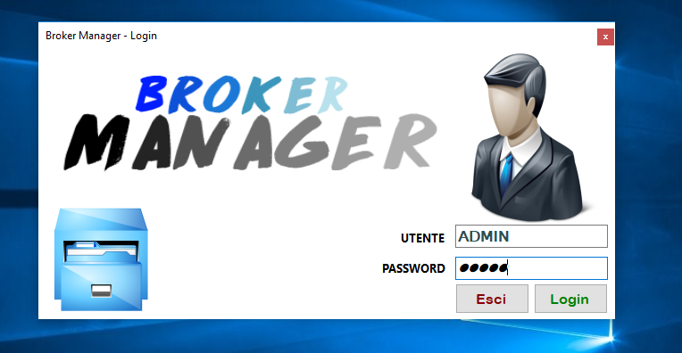
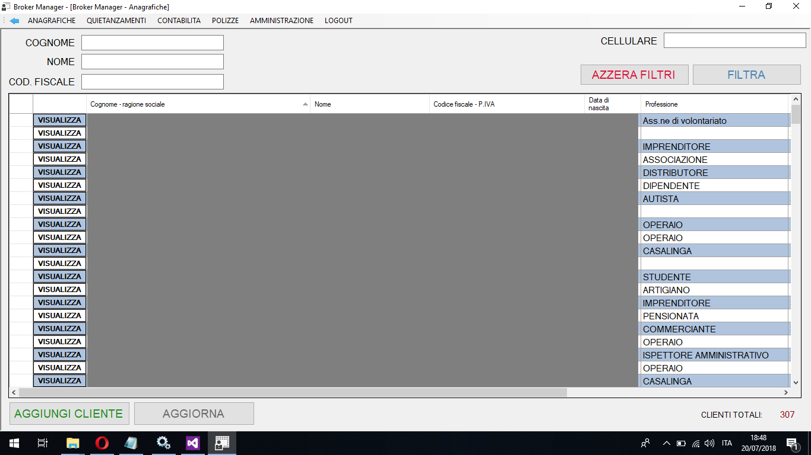
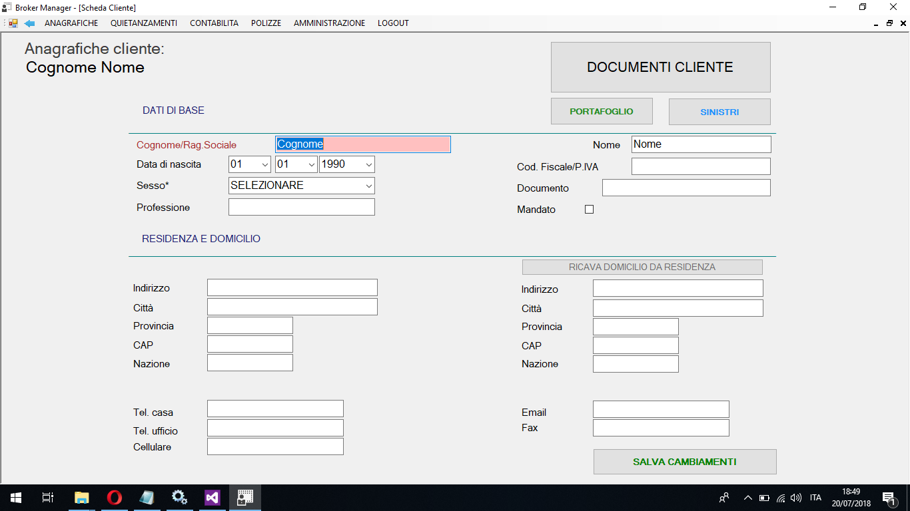
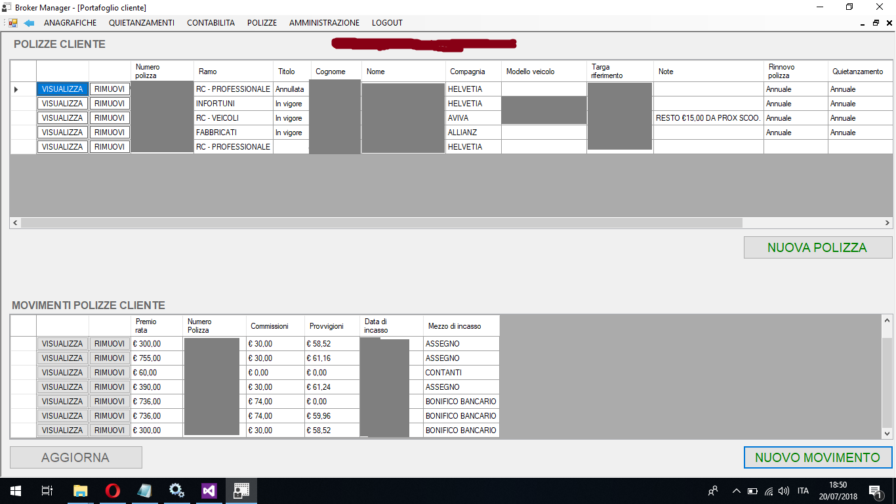
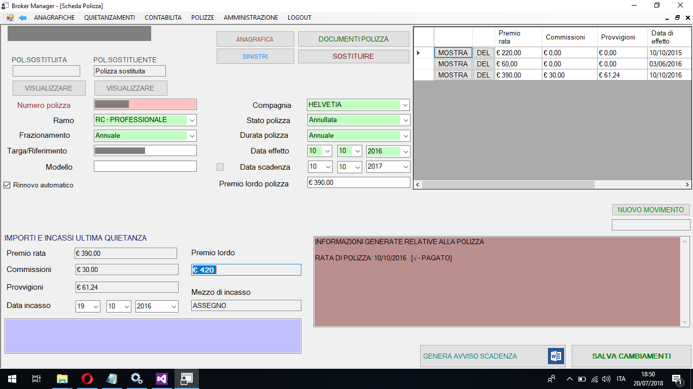
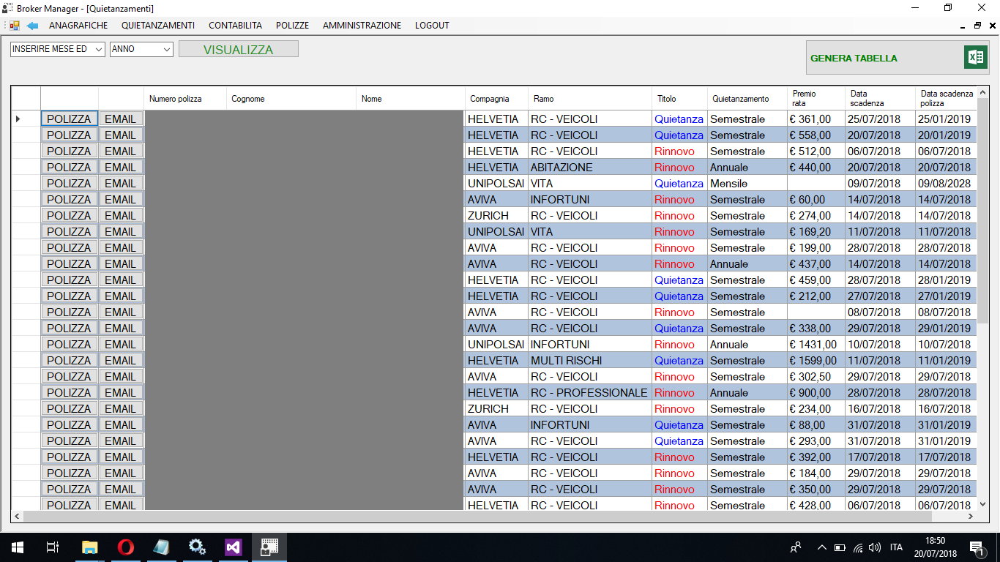
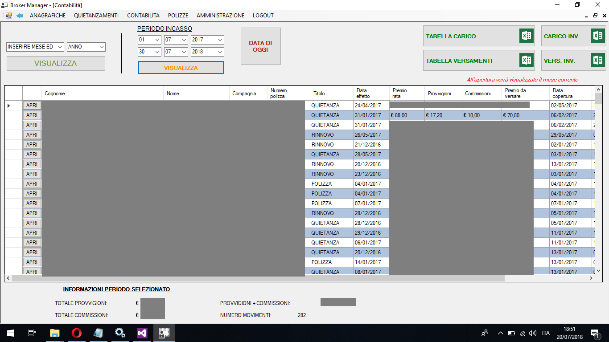

# Broker Manager Repository

This repository contains the images reporting the work done developing this software.

Basically it is a C# application .NET associated to a MSSQL database, with the possibily of exporting data into Excel files(eg. regarding accounting) and sending payment deadline automatically by email to costumers.

For any information you can contact me:  
Alberto Macario: alberto.macario@hotmail.it or https://www.linkedin.com/in/alberto-macario

  
## Pictures

Login page

Costumers page:

Add a costumer:

Costumer's wallet:

Insurance policy:

Payment deadline:

Accounting:

